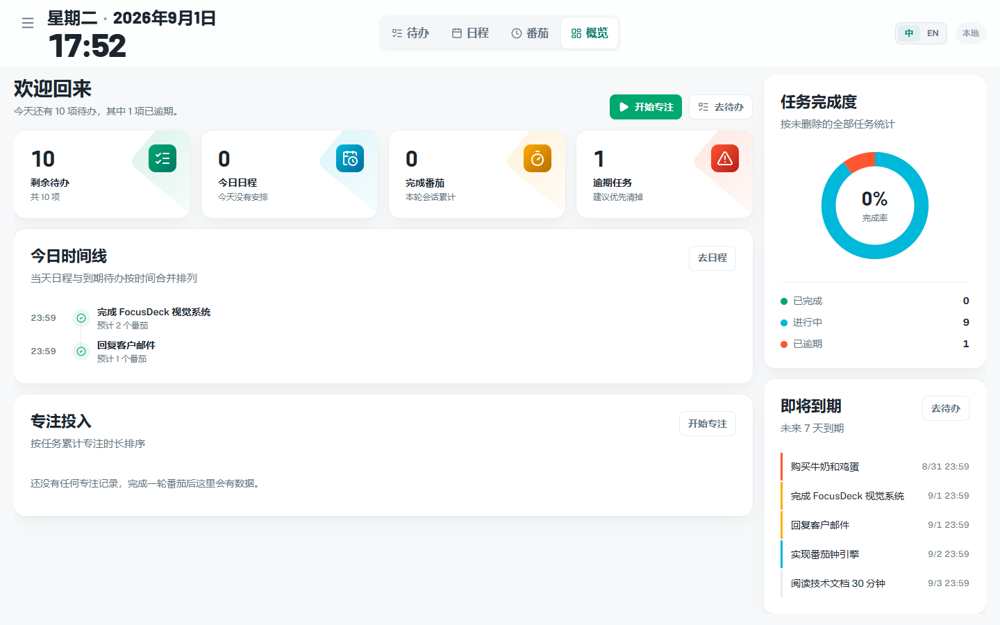
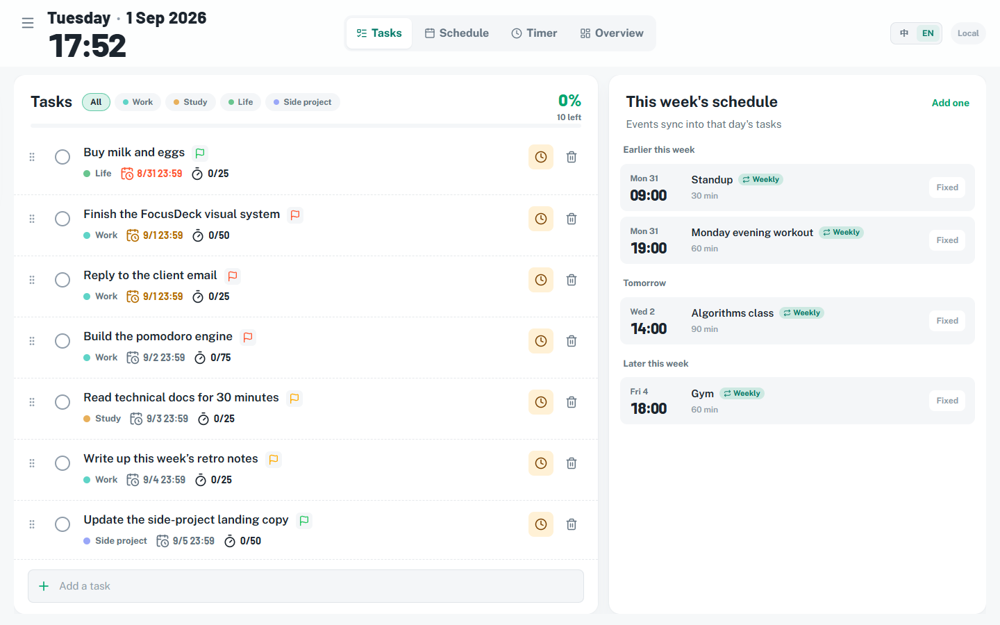
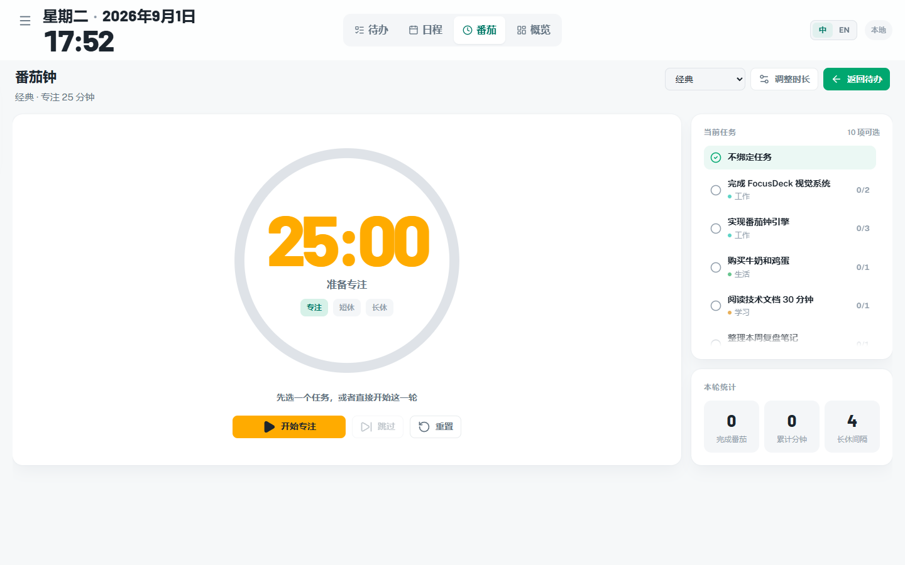
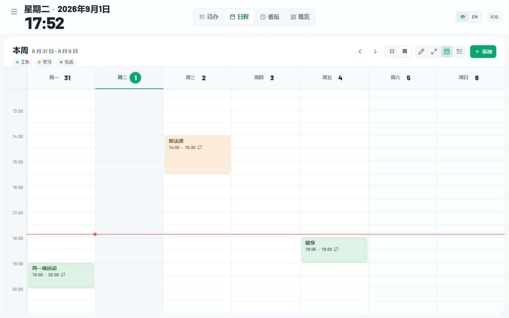
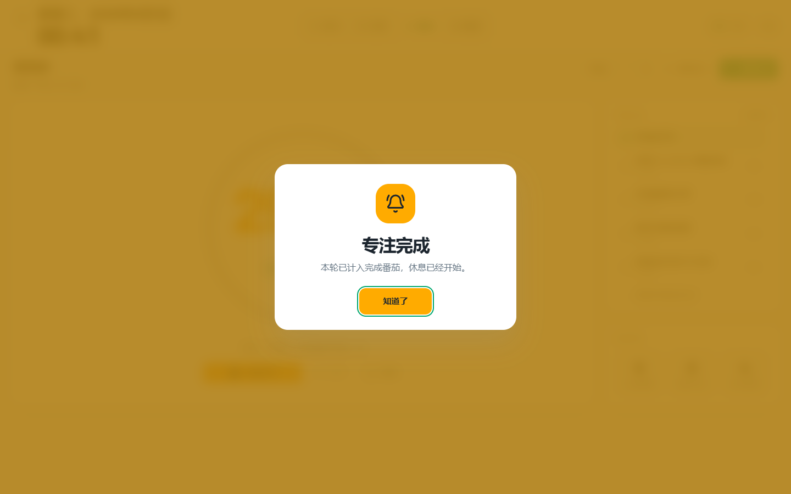

# FocusDeck

[](https://github.com/Picadoo/focusdeck/actions/workflows/ci.yml)
[](LICENSE)

[English](README.en.md) · **简体中文**

第三屏全屏生产力工作台 —— 专业待办、番茄钟、课程表式日程三合一。中英双语，可选自托管同步。

**▶ 在线试用：https://picadoo.github.io/focusdeck/** —— 不用登录、不用装任何东西，数据只存在你自己的浏览器里。
安卓包在 [Releases](https://github.com/Picadoo/focusdeck/releases) 里。

## 界面

概览页：今日四项指标、时间线、完成度环、即将到期。



待办页（英文界面，顶栏 `中 / EN` 一键切换，切换即时生效）：左侧任务、右侧本周日程，日程事件会并进当天的任务视图。



<table>
<tr>
<td width="50%"></td>
<td width="50%"></td>
</tr>
<tr>
<td>番茄钟：三种档位，可绑定任务</td>
<td>课程表式周视图：当前时间线、重复事件</td>
</tr>
</table>

番茄钟结束时的全屏色脉冲（截于波峰；600ms 一次、脉冲三次即停，压在 WCAG 光敏性癫痫红线之下）：



## 当前进度

网页端是主体且功能完整，另有一个自托管同步服务端和一个安卓壳，技术栈为：

- Vite 8 + React 19 + TypeScript 6
- 手写 CSS + 设计令牌（`src/styles/index.css` 里 70 个 CSS 变量），**没有引入任何 UI 框架**，
  PostCSS 只挂 autoprefixer
- Zustand（本地状态 + persist）
- TanStack Query（为后续 Tauri IPC 预留）
- 服务端：Hono + better-sqlite3 + JWT（`server/`，可选，不开也能用）
- 安卓端：Capacitor 8 + 一个原生提醒插件（`android/`）
- Tauri 2 已初始化（待本机 Rust 编译环境就绪后构建）

## 已实现功能

- 浅色仪表盘布局，四个页面：概览 / 待办 / 日程 / 番茄钟，桌面走顶栏、手机走底栏
- 待办事项：项目、优先级、标签、搜索、完成状态、进度条、快速添加
- 番茄钟：经典/深度/长专注三种配置，防漂移计时，开始/暂停/继续/跳过/重置，任务绑定
- 课程表式周视图：全天 24 小时、当前时间线、默认示例事件、周切换
- 沉浸模式：按 `F` 切换，按 `Esc` 退出
- 番茄钟快捷键：`Space` 开始/暂停/继续（输入框外）
- 数据本地持久化（localStorage），**不连服务端也是完整可用的**
- 可选的自托管云同步：`server/` 提供带 JWT 鉴权的增量同步 API，多端按时间戳合并，断网照常写、联网再对账
- 安卓端：Capacitor 8 打包，带原生提醒插件与应用内通知自检面板（APK 能出包，**真机尚未验证**）
- 中英双语，顶栏 `中 / EN` 一键切换：切换即时生效、刷新后保持，日期格式与星期名跟着走
- 番茄钟结束提醒分三层，按「人在哪儿」覆盖：窗口可见时全屏色脉冲（三次即停，遵守
  `prefers-reduced-motion`）、切到别的标签页时标题闪烁 + favicon 变色、切到别的应用时常驻系统通知

## 运行方式

```bash
git clone https://github.com/Picadoo/focusdeck.git
cd focusdeck
pnpm install
pnpm dev
```

然后打开 http://localhost:5173。**不需要跑服务端**——不登录时数据存在 localStorage 里，功能是完整的。

## 构建前端

```bash
pnpm build
```

产物在 `dist/`。

## 国际化（中 / EN）

字典在 `src/i18n/`，`zh.ts` 与 `en.ts` 键集一一对应，`MessageKey` 由 `zh.ts` 反推
（`export type MessageKey = keyof typeof zh`），所以**加键先加 `zh.ts`**，`en.ts` 少一条就是类型错误。

分两层是为了断开循环依赖，加代码时别接错：

| 层 | 文件 | 谁用 |
| --- | --- | --- |
| 内核 | `i18n/messages.ts` | `lib/utils.ts`、`lib/data.ts`、原生通知等**非 React 模块**，走模块级 `t()` |
| React 层 | `i18n/index.ts` | 组件，走 `useI18n()`；语言一变整棵树重渲染 |

内核里的 `activeLocale` 由 `uiStore` 在三个时机推送：模块初始化、`setLocale`、`onRehydrateStorage`。
非 React 模块只能依赖内核层——反过来 import `index.ts` 会绕回 `uiStore` 成环。

两条容易踩的：

- `data.ts` 里的默认项目 / 标签 / 番茄档位是**函数不是常量**。常量在模块加载期求值，那会儿语言还没定，会永远停在猜测值上。
- 组件里若在 `useMemo` 中调模块级 `t()`，必须把 `locale` 放进依赖数组。linter 看不见这层依赖会报
  `exhaustive-deps`，那是误报，加 `eslint-disable-next-line` 并写明原因，别删依赖。

查漏与验收：

```bash
node scripts/i18n-scan.mjs                # 扫剩余未翻译的中文字面量；有漏翻则退出码 1（CI 门禁走这条）
node scripts/i18n-scan.mjs --report-only  # 只看报告不要失败码
python testkit/verify_i18n.py             # 端到端：lang/title 跟随、两语言互斥、切换即时、刷新保持
```

## 番茄钟结束提醒

声音之外还有两条视觉通道，因为「没戴耳机就完全错过」是这类工具的常见失效。三层按**人在哪儿**分：

| 人在哪儿 | 通道 | 实现 |
| --- | --- | --- |
| 正看着 FocusDeck | 全屏色脉冲 + 卡片入场 | `timer-alerts.css`，3 × 600ms 后停在淡色 |
| 浏览器的别的标签页 | 标题闪烁 + favicon 变色 | `TabAttention` + `lib/favicon.ts` |
| 别的应用里 | 常驻系统通知 | `alerts.ts`，`requireInteraction` 且失焦即发 |

改这块时注意两条：

- **脉冲频率不能随便调快。** 600ms 一次约 1.67 Hz，是照 WCAG「每秒不超过三次闪光」的光敏性癫痫上限定的，
  且必须保留 `prefers-reduced-motion` 的退化分支——这东西会在用户毫无防备时突然全屏亮起。
- **`document.title` 只能有一个所有者。** 专注结束后休息立刻开跑、计时文案每秒重写一次，
  另起一个组件写标题必然与之互相冲掉，所以提醒态与计时态在 `TabAttention` 的同一个 effect 里分支。

```bash
python testkit/verify_timer_alert.py   # 三层各一组断言，量真实 DOM
python testkit/shot_timer_alert.py     # 出截图：脉冲波峰与常驻态各一张
```

## 部署到自己的服务器（systemd，不用 Docker）

**目标机上不跑任何 npm、不装编译器。** 唯一的原生依赖 `better-sqlite3` 的 Linux 预编译产物
也在本机拉好一起打进包里。这条约束不是洁癖：小内存 VPS 上 `npm install` 既慢，又可能因为
要现编原生模块直接失败。

### 一次性准备（目标机）

装 Node 运行时 —— 解压官方 tarball，不编译、不需要 gcc：

```bash
NODE=v22.23.2
curl -fsSL -o /tmp/node.tar.xz https://nodejs.org/dist/$NODE/node-$NODE-linux-x64.tar.xz
sudo mkdir -p /opt/node && sudo tar -xJf /tmp/node.tar.xz -C /opt/node --strip-components=1

sudo useradd --system --no-create-home --shell /usr/sbin/nologin focusdeck
sudo mkdir -p /opt/focusdeck/data && sudo chown -R focusdeck:focusdeck /opt/focusdeck
```

凭据写 `/opt/focusdeck/.env`（`0600 root:root` 就行——systemd 是以 root 读它再降权的）：

```
FOCUSDECK_USER=focus
FOCUSDECK_PASSWORD_HASH=<node server/dist/hash-password.js 你的密码>
JWT_SECRET=<随机长字符串>
```

不写也能起：首次启动会自己生成密钥与初始密码，写进 `DB_PATH` 所在目录，并**在日志里打印一次**。

### 每次发布（本机一条命令）

```bash
node scripts/pack-server.mjs --node 22.23.2
```

它做六件事：编译服务端 → 构建前端 → 只装生产依赖 → 把 `better_sqlite3.node` 换成
linux-x64 预编译版 → **校验头四字节确实是 ELF** → 打成 `focusdeck-svc.tar.gz`（约 4.3 MB）。

那个 ELF 校验不是装饰：`npm ci` 装的是本机平台的版本，`prebuild-install` 万一静默失败，
留下的就还是本机那个——包看着好好的，传上去启动才报 `invalid ELF header`。

然后：

```bash
scp focusdeck-svc.tar.gz user@host:/tmp/
ssh user@host '
  sudo rm -rf /opt/focusdeck/svc && sudo mkdir -p /opt/focusdeck/svc
  sudo tar -xzf /tmp/focusdeck-svc.tar.gz -C /opt/focusdeck/svc
  sudo chown -R focusdeck:focusdeck /opt/focusdeck/svc
  sudo cp /opt/focusdeck/svc/focusdeck.service /etc/systemd/system/
  sudo systemctl daemon-reload && sudo systemctl enable --now focusdeck'
```

单元文件在 [`deploy/focusdeck.service`](deploy/focusdeck.service)，已经收好权
（`ProtectSystem=strict`，只有 `/opt/focusdeck/data` 可写）。默认 `PORT=8788`、`HOST=0.0.0.0`。

### 一个进程同时发前端和 API

包里带 `public/`，`STATIC_DIR` 指向它，所以**不需要 nginx**：`/` 发前端、`/assets/*` 长缓存
`immutable`、`index.html` 强制回源、未知路径回退到 SPA，而 `/api/*` 未命中仍是 JSON 404
不会被兜底吃掉。CORS 已放行 `capacitor://localhost` 与 `tauri://localhost`，安卓端直接能连。

前端资源打包时**不能带 `--base`**——服务端从根路径发，带前缀会让所有资源 404。
`--base=/focusdeck/` 只用于 GitHub Pages 那条线，两者不能共用一份产物。

### 备份与回滚

数据全在 `/opt/focusdeck/data`（`focusdeck.db` + WAL，以及未用 `.env` 时自举出的
`jwt-secret` / `password-hash`），`cp -a` 整个目录就是完整备份。

**换 `JWT_SECRET` 会让所有已登录设备集体掉线**，所以从旧部署迁过来时要沿用同一份 `.env`。

<details>
<summary>历史：曾经的 Docker 部署（已停用，别照着做）</summary>

`Dockerfile` / `docker-compose.yml` / `deploy/focusdeck.compose.yml` 还在仓库里，
因为这套 compose 曾在真服务器上跑通过八条端到端断言（含「容器重建不掉线、不改密」），
删掉就找不回来了。但它**不再是推荐路径**，现网已经切到上面的 systemd 方案。

```bash
docker compose up -d --build
docker compose logs focusdeck        # 首次启动会在这里打印初始密码
```

数据在命名卷 `focusdeck-data`，备份导出这个卷。

</details>

## Tauri 构建说明

当前 Tauri 2 已初始化，但由于本机 Git Bash 自带的 MinGW 缺少 `dlltool.exe`，`x86_64-pc-windows-gnu` target 无法完成链接。需要以下任一方案后才能构建 Windows 安装包：

1. 安装完整 MSYS2 / MinGW-w64 工具链（推荐），补充 `dlltool.exe`；
2. 或安装 Visual Studio Build Tools 并添加 `x86_64-pc-windows-msvc` target，改用 MSVC 构建。

安装完成后运行：

```bash
pnpm tauri-build
```

## 改样式前先建像素基线

CSS 重构最难的不是改，是证明没改坏——肉眼比两张截图、或者只跑「不溢出不报错」那类断言，
都漏得掉一像素的偏移和一个色阶的差别。`testkit/pixel_baseline.py` 把「视觉零变化」变成一个能打印出来的数字：

```bash
python testkit/pixel_baseline.py capture .baseline/before
# ...改 CSS，pnpm build...
python testkit/pixel_baseline.py capture .baseline/after
python testkit/pixel_baseline.py compare .baseline/before .baseline/after
```

四个页面 × 五档视口共 20 张，逐像素比，**不设容差**：一个像素差一个色阶也会被报出来，
差异处会输出染红的 `diff-*.png`。

**先跑一次空对照。** 什么都不改，连截两次再比——必须是零差异。这一步不是多余的：
它验证的是「两次运行本来就一样」这个前提（时钟冻结在 `FROZEN`、数据来自固定种子、语言写死 `zh-CN`）。
前提不成立的话，改完之后那个 PASS 什么也证明不了。

## 设计令牌

`src/styles/index.css` 的 `:root` 是**唯一**的颜色出处，各 feature CSS 里不该再出现色号字面量。

配色照搬 Minimals 调色板，每个色都有 `main / dark / darker / contrastText` 四档。要注意
**warning 的对比色是深色 `#1c252e` 不是白**（`--on-focus`）——`#ffab00` 太亮，白字在上面几乎看不清。

例外只有三类，它们留着字面量是对的：`color-mix()` 与 `mask-image` 里的 `#000` 是算法参数不是颜色选择；
日程网格线在 `.schedule-grid` 上有自己的一套局部变量；遮罩层的 `rgba(...)` 是各用一次的一次性值。

## 目录结构

```
focusdeck/
├── src/                    # React 前端
│   ├── features/           # 功能模块
│   │   ├── nav/            # 侧栏 / 底栏导航、语言切换器
│   │   ├── overview/       # 概览页
│   │   ├── tasks/          # 待办事项
│   │   ├── timer/          # 番茄钟（含结束提醒 TimerAlerts）
│   │   ├── schedule/       # 课程表式日程
│   │   ├── sync/           # 登录、同步状态、通知自检
│   │   └── workspace/      # 页面容器
│   ├── i18n/               # 中英字典与翻译内核（见「国际化」一节）
│   ├── stores/             # Zustand 状态
│   ├── styles/             # 全局样式与设计令牌
│   ├── lib/                # 工具函数、默认数据、提醒、同步
│   ├── App.tsx
│   └── main.tsx
├── src-tauri/              # Tauri 2 Rust 后端
├── android/                # Capacitor 8 安卓工程
├── server/                 # Hono + better-sqlite3 同步 API
├── testkit/                # Playwright 验收（冻结时钟 + 种子 + 量几何）
├── scripts/                # 开发辅助：i18n 扫描、内存守护、显示器探测
├── docs/screenshots/       # README 用的界面截图
├── index.html
├── vite.config.ts
├── postcss.config.js
└── package.json
```

## 下一步计划

- [ ] 配置完整 Windows 构建工具链，成功编译 Tauri 安装包
- [ ] 实现 Rust 端番茄钟引擎与 SQLite 持久化
- [ ] 实现显示器检测与第三屏全屏启动
- [ ] 任务拖拽排序与拖入日程表
- [ ] 课程重复规则（单双周、指定周）
- [ ] 原生通知、音效与托盘图标
- [ ] 安卓真机验证（APK 已能出包，但至今没在真机上跑过）

## 许可证

[MIT](LICENSE)。
